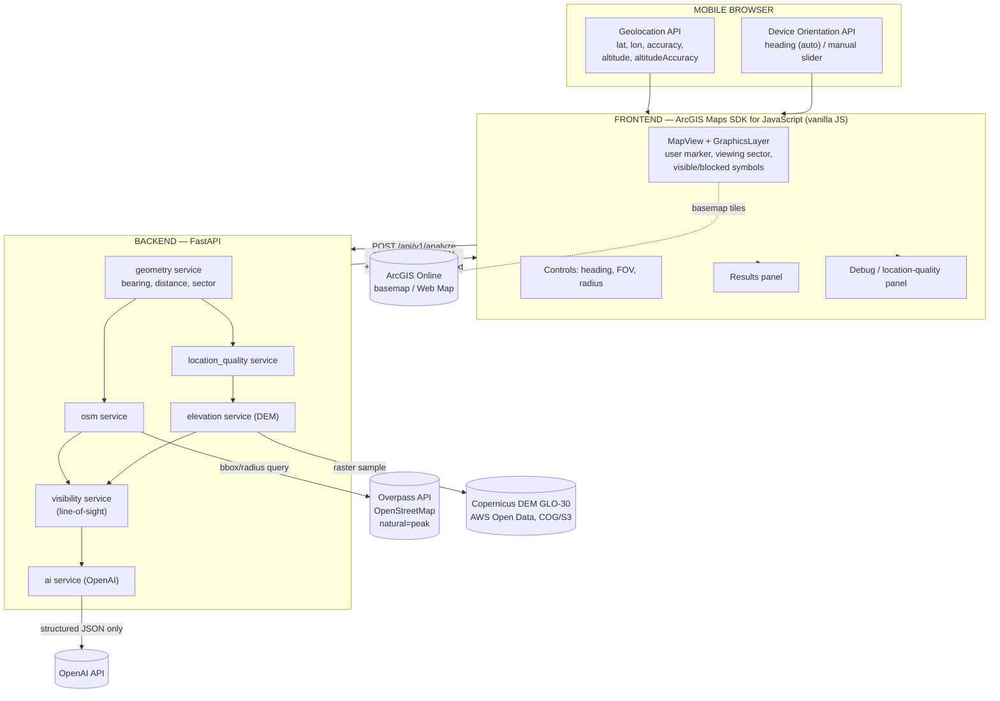

# GIS Landscape Identification MVP — Architecture & Feasibility Review

**Status:** ODOBRENO od strane vlasnika projekta (septembar 2026). Osnova za PHASE 1 i sve dalje faze. Čuva se u projektu i ažuriraćemo ga ako se arhitektura promijeni tokom razvoja.

---

## 0. Odluke usvojene nakon review-a

Dvije tačke iz prvobitnog nacrta su eksplicitno odlučene:

1. **Earth curvature — OSTAJE VAN MVP-a (Future/Phase 2), ne ulazi u Phase 8.** Moj prvobitni predlog je bio da uđe u MVP jer na 30–50 km pravi grešku od 60–200 m. Vlasnik projekta je odlučio da MVP scope ostaje geografski fokusiran na **Srbiju**, koja nije veliki prostor — praktični radijusi koje ćemo koristiti u test scenarijima (sekcija 15) i podrazumijevani opseg (sekcija 19 originalnog brifa: 5–30 km tipično) su dovoljno mali da je greška od zakrivljenosti Zemlje zanemarljiva (na 20 km ≈ 14 m prije refrakcije, na 30 km ≈ 31 m — mnogo manje nego na 50 km). Formula i dalje ostaje **dizajnirana da se lako doda kasnije** (parametar/config flag u `visibility.py`, isključen po defaultu), tačno kako je i originalni brief tražio ("dizajn treba omogućiti kasnije dodavanje"), ali se ne implementira aktivno u MVP-u. Sekcija 9 je ažurirana u skladu s ovim.

2. **Elevation fusion (phone + DEM) — POTVRĐENO: NE ulazi u MVP, ni kao opcija.** DEM ostaje jedini autoritativni izvor elevacije; phone altitude ostaje čista dijagnostika. Puna geoid-korigovana fuzija ostaje Phase 2 stavka (plan opisan u sekciji 6).

Sve ostalo iz originalnog brifa je tehnički zdravo i implementira se kako je zamišljeno, uz pragove i objašnjenja koja slijede.

---

## 1. Finalna arhitektura

Sistem se sastoji od četiri sloja:

- **Mobile browser sloj** — Geolocation API + Device Orientation API, samo prikupljanje sirovih senzorskih podataka, bez logike.
- **Frontend (ArcGIS Maps SDK for JavaScript, vanilla JS)** — prikaz karte, viewing sector, kontrole, results panel, poziv backend API-ja.
- **Backend (FastAPI)** — deterministički GIS engine: geometrija, OSM, DEM, visibility, location quality. Ovo je "mozak" sistema.
- **Eksterni servisi** — Overpass API (OSM), Copernicus DEM (AWS Open Data), OpenAI API (samo za tekst na kraju), ArcGIS Online (basemap/Web Map).

Ključna odluka koju vrijedi eksplicitno reći: **frontend ne radi nikakvu GIS matematiku osim vizuelnog crtanja sektora.** Sva distance/bearing/visibility logika živi u backendu, testabilna je i nezavisna od browsera. To je direktna posljedica tvog principa "Geospatial analysis first, AI second" — samo prošireno na "i frontend je glup, backend je pametan".

### Frontend: vanilla JS umjesto React — objašnjenje kompromisa

Predlažem **HTML/CSS/vanilla JavaScript (ES moduli)**, ne React + Vite.

Razlog: MVP ima jedan ekran, jednu kartu, jedan rezultat-panel i par kontrola. React donosi build pipeline, state management mentalni overhead i dependency surface koji ovom projektu ne servisira nikakvu stvarnu potrebu — a scope discipline je eksplicitno tvoj prioritet. ArcGIS Maps SDK for JavaScript se prirodno koristi imperativno (kreiraš View, dodaješ Graphics), što se dobro uklapa u vanilla JS bez posebnog "adaptera" kakav bi trebao za React.

Kompromis: portfolio recenzenti (posebno frontend-orijentisani) ponekad očekuju React na CV-u. Ako ti je to bitno za target auditorijum na LinkedInu, React + Vite je i dalje razuman izbor i SDK ima zvaničan React wrapper (`@arcgis/core` + `@arcgis/map-components` ili `arcgis-react`). Ali za MVP koji mora biti završen, vanilla JS je manje pokretnih dijelova. Ako se kasnije pokaže da ti treba React na portfoliju, to je čist rewrite frontend sloja bez diranja backend/GIS logike — što je i dokaz dobre separacije slojeva.

**Preporuka: vanilla JS za MVP.**

---

## 2. Architecture diagram



---

## 3. Technology stack

| Komponenta | Tehnologija | Zašto | Alternative | Trošak |
|---|---|---|---|---|
| Karta / frontend GIS | ArcGIS Maps SDK for JavaScript | Zahtjev projekta; demonstrira Esri skill; puna kontrola nad geometrijom (custom sector) | Leaflet + OSM tiles (besplatnije, ali gubi Esri deo priče) | Vidi sekciju 4 — basemap tile requests su besplatni do praga |
| Frontend jezik | Vanilla JS (ES moduli), HTML, CSS | Mali scope, bez build overhead-a | React + Vite | 0 |
| Backend framework | FastAPI | Async, automatski OpenAPI/Swagger dokumenti, Pydantic native, brz razvoj | Flask (manje "besplatne" dokumentacije), Django (preglomazno) | 0 |
| Validacija / modeli | Pydantic v2 | Tip-sigurni request/response modeli, auto-validacija | dataclasses + ručna validacija | 0 |
| Geodetski proračuni | `pyproj` + ručne formule (haversine/Vincenty varijante) | Tačan geodesic distance/bearing, industrijski standard | `geopy` (wrapper oko istih formula) | 0 |
| Geometrija (sektor) | `shapely` | Konstrukcija poligona sektora, provjera tačaka unutar poligona | Ručna trig implementacija | 0 |
| Rasterio pristup DEM-u | `rasterio` (+ `rioxarray` opciono) | Čitanje Cloud-Optimized GeoTIFF-a direktno sa S3, windowed read | GDAL direktno (niži nivo, više koda) | 0 |
| Numerika | `numpy` | Vektorizovan line-of-sight profil (brže od Python petlje) | čist Python | 0 |
| HTTP klijent | `httpx` (async) | Async poziv ka Overpass i OpenAI, konzistentno sa FastAPI async modelom | `requests` (sinhrono, blokira event loop) | 0 |
| OSM podaci | Overpass API (`overpass-api.de` ili `overpass.kumi.systems`) | Besplatan pristup OSM podacima po prostornom upitu | Vlastita Overpass instanca (nepotrebno za MVP) | 0, uz fair-use limite (sekcija 7) |
| Elevacija | Copernicus DEM GLO-30 preko AWS Open Data (S3, COG) | Besplatno, bez naloga, globalno pokriće, deklarisan vertikalni datum | ArcGIS Location Platform elevation servis (50.000 tačaka/mjesec besplatno) kao dopuna/fallback | 0 |
| AI opis | OpenAI API (npr. GPT-4o-mini klasa modela za trošak) | Već imaš pristup; kratak tekst na kraju pipeline-a | Bilo koji LLM API | Nisko (par centi po demo sesiji ako se ograniči broj tokena) |
| Version control | GitHub | Zahtjev projekta (portfolio) | — | 0 |
| Frontend hosting | GitHub Pages | Besplatno, HTTPS automatski, prirodno se uklapa u "profesionalan repo" narativ | Vercel / Netlify | 0 (vidi sekciju 17) |
| Backend hosting | Render (Free Web Service) | Besplatno, bez kartice, Git-based deploy | Railway (više nije realno besplatan), Fly.io (bez free tier-a) | 0, uz cold-start caveat (sekcija 17) |

---

## 4. Esri arhitektura — šta tačno koristimo i gdje se troše krediti

Ovo je sekcija u kojoj je najvažnije biti precizan, jer credits koštaju stvaran novac ako se pogriješi.

### Šta koristimo iz ArcGIS Online

- **Web Map** (item u tvom ArcGIS Online nalogu) koji definiše basemap i početni extent. Frontend učitava taj Web Map preko `WebMap` klase iz SDK-a umjesto da ručno sastavlja `Map` sa hardcodovanim slojevima. Ovo je opravdano jer: (a) direktno demonstrira ArcGIS Online kao stvarnu infrastrukturu (item se vidi u tvom AGOL nalogu, ima sharing podešavanja, može se javno podijeliti), (b) omogućava da basemap promijeniš iz AGOL-a bez diranja koda.
- **Basemap** unutar tog Web Map-a (npr. Topographic ili Imagery Hybrid — dobar izbor za planinare jer prikazuje relief).
- **Application item** — sam frontend registrujemo kao ArcGIS Online "Application" item (tip: Web Mapping Application), povezan na Web Map. Ovo je čisto organizaciono (vidljivost u AGOL-u, sharing), ne generiše dodatni trošak.

### Šta koristimo iz ArcGIS Maps SDK for JavaScript

- `MapView` (2D je dovoljan i brži za mobile — 3D `SceneView` nije potreban jer ne radimo 3D terrain vizualizaciju u MVP-u).
- `GraphicsLayer` za: observer marker, viewing sector (poluprovidan poligon), visible/blocked simbole za vrhove.
- `Point`, `Polygon` geometrijske klase — sektor gradimo ručno (vidi sekciju 8) i crtamo kao `Polygon` graphic, **ne** kao gotov widget. Ovo direktno adresira tvoj zahtjev da custom logika bude vidljiva, ne sakrivena iza gotovog widgeta.
- `Popup` za klik na vrh (prikaz distance/bearing/elevation/status).
- `geometryEngine` opciono za pomoćne operacije (npr. provjeru da li tačka upada u poligon sektora na frontendu radi live preview-a dok korisnik pomjera slajdere — ali finalna odluka o kandidatima uvijek dolazi iz backend odgovora).

### Autentifikacija — ažurirano u Phase 1 (OAuth 2.0 App authentication umjesto plain API key-a)

Prilikom implementacije Phase 1 otkriveno je da korisnikova ArcGIS Online organizacija ima **isključeno izdavanje plain "API key" credentials** (admin security policy — AGOL prikazuje "Looking for API key credentials? Contact your system's administrator for access" i nudi samo OAuth 2.0 opcije). Ovo mijenja tehnički detalj (ne suštinu) sekcije 4:

- Umjesto statičnog, u frontend kod upisanog API key-a, koristimo **OAuth 2.0 credentials tipa "App authentication"** (client_credentials grant — pristup bez prijave korisnika, isti use-case kao plain API key).
- **`client_id` i `client_secret` ostaju na backendu** (`backend/.env`, isti nivo tajnosti kao `OPENAI_API_KEY`) — ovo je bitna razlika u odnosu na plain API key, koji je po dizajnu bio klijentski/javan. Backend (`app/services/arcgis_auth.py`) razmjenjuje ih za kratkotrajan access token preko ArcGIS OAuth token endpointa i servira ga frontend-u preko novog `GET /api/v1/arcgis-token` endpointa (token se cache-uje u memoriji procesa dok ne istekne).
- Frontend (`src/services/arcgisAuthService.js`) dohvata taj token pri startu i postavlja ga na `esriConfig.apiKey` — SDK ovo tretira identično kao statičan API key (Esri dokumentacija to potvrđuje: access token iz OAuth app-auth razmjene se koristi "isto kao API key" u zahtjevima).
- Ovo je zapravo **bolja** sigurnosna praksa za portfolio nego plain API key (jasnija demonstracija razumijevanja Esri auth modela), samo zahtijeva jedan dodatni backend endpoint koji plain-key pristup ne bi tražio.
- Ako je korisnik u budućnosti org admin ili dobije pristup od admina, plain API key ostaje jednostavnija alternativa — kod je strukturiran tako da bi zamjena bila lokalizovana samo u `mapSetup.js`/`arcgisAuthService.js`, bez uticaja na ostatak sistema.

### Gdje se troše krediti — i koliko

| Servis | Troši credits? | Približan trošak | Napomena |
|---|---|---|---|
| Prikaz basemap tiles u Web Map-u (JS SDK, standardni Esri basemap stilovi) | Metered kroz ArcGIS Location Platform tile model: **2.000.000 tile requests/mjesec besplatno**, zatim $0.15/1000 tiles | Za demo/portfolio saobraćaj, praktično nedostižno u besplatnoj zoni | Isti model se primjenjuje bez obzira da li se koristi plain API key ili OAuth app-auth access token (vidi podsekciju "Autentifikacija" iznad) — credential tip utiče na to KAKO se autentifikujemo, ne NA ŠTA se troši. Kako se tvoja postojeća ArcGIS Online organizaciona licenca tačno poklapa sa ovim (da li org dobija odvojenu, često veću ili "uključenu" alokaciju za bazne basemape) **nije mi pouzdano potvrđeno iz dokumentacije koju sam pronašao** — preporuka je da se ovo empirijski provjeri u Phase 1 (praviš prazan Web Map + JS SDK app, gledaš credit dashboard u AGOL-u par dana) prije nego što se osloniš na broj. |
| Query Elevation / Profile / Viewshed geoprocessing alati u ArcGIS-u | **Ne** — Esri je ova tri alata učinio besplatnim (više ne troše credits) | 0 | Mi ionako ne koristimo ove alate — radimo vlastiti line-of-sight nad Copernicus DEM-om, ovo je samo za informaciju ako se ikad odluči koristiti Esri-jev elevation servis kao alternativu. |
| ArcGIS Location Platform elevation point servis (`/elevation/at-point`) | Da, ali sa **50.000 elevation points/mjesec besplatno** | 0 unutar besplatne zone | Ne koristimo ga kao primarni izvor (koristimo Copernicus DEM direktno radi rasterio/DEM skilla), ali dokumentujemo kao validacioni alat (sekcija 16) i kao Phase 2 fallback ako Copernicus pipeline ikad zakaže. |
| Geocoding (World Geocoding Service) | Da, 40 credits/1000 geokodiranja | Ne koristimo geocoding u MVP-u (nema pretrage adresa) | 0 |
| Routing | Da | Ne koristimo | 0 |
| Feature/imagery storage | Da, ali samo ako hostujemo feature layer | Ne hostujemo feature layer (peak podaci dolaze live iz Overpass-a, ne skladište se u AGOL-u) | 0 |

### Kako minimizujemo credit usage

1. Ne hostujemo nikakav feature layer u AGOL-u — svi geografski objekti (peaks) dolaze runtime iz Overpass-a i vraćaju se kao JSON, crtaju se kao klijentski `Graphic` objekti. Nema storage troška.
2. Ne koristimo AGOL geocoding ni routing.
3. Koristimo 2D `MapView`, jedan basemap, bez dodatnih premium slojeva (Imagery sa visokom rezolucijom, demografski slojevi itd. bi trošili credits — izbjegavamo ih).
4. DEM podatke povlačimo direktno sa AWS Open Data (Copernicus), ne kroz plaćeni Esri elevation servis, čime elevation dio pipeline-a potpuno izlazi iz AGOL credit ekonomije.
5. Prije javnog objavljivanja demoa, provjerimo AGOL credit dashboard nakon dan-dva testiranja da potvrdimo pretpostavku o basemap tile trošku.

---

## 5. DEM strategija

### Analiza

**Copernicus DEM GLO-30** je ispravan izbor. Ključne činjenice (provjereno kroz AWS Registry of Open Data i Copernicus dokumentaciju):

- **Pristup:** javni S3 bucket `copernicus-dem-30m` (region `eu-central-1`), format **Cloud-Optimized GeoTIFF (COG)**, dostupan bez AWS naloga (`aws s3 cp --no-sign-request` ili direktan HTTPS pristup). Postoji i STAC katalog za pretragu tile-ova po bounding box-u.
- **Licenca:** besplatna za opštu upotrebu ("free and open" prema Copernicus DEM licenci).
- **Rezolucija:** 30 m horizontalna (GLO-30 Public verzija; postoji i GLO-90 sa 90 m, ne koristimo je).
- **Vertikalni datum:** orthometric height iznad **EGM2008 geoid-a** (EPSG:3855). Ovo je ključna činjenica za sekciju 6.
- **Vertikalna tačnost:** DEM sadrži poseban **Height Error Mask (HEM)** band koji procjenjuje standardnu devijaciju po pikselu (raspon otprilike 0.09–43 m, zavisno od terena) — ovo je koristan, dokumentovan signal koji možemo (opciono, Phase 2) izložiti kao dodatnu dijagnostiku, jer je bolji od paušalnog "±X m" broja.
- **Downloadovanje tile-ova nije potrebno unaprijed.** Zahvaljujući COG formatu i `rasterio`-vom windowed read-u, možemo čitati samo potreban prozor piksela direktno preko HTTP range requestova, bez preuzimanja cijelog tile-a (~25 MB po 1°×1° tile-u na 30 m). Za MVP sa radijusom do 50 km, potrebno je 1–4 susjedna tile-a po zahtjevu.
- **Performanse:** prvi pristup tile-u ima latenciju (S3 GET + network), ali može se cache-ovati na disku backend servera (jednostavan lokalni fajl-cache po imenu tile-a) da se izbjegne ponovno preuzimanje pri sljedećim zahtjevima u istoj oblasti — korisno za demo i testiranje gdje se ista test-lokacija poziva više puta.
- **ArcGIS opcije:** postoji alternativa (ArcGIS Location Platform elevation servis, 50.000 tačaka/mjesec besplatno) — vidi sekciju 4. Ne biramo je kao primarnu jer direktan rad sa DEM rasterom (rasterio, windowed read, sampling) je upravo ono što brief traži da se demonstrira kao GIS/Python vještina; gotov REST elevation servis bi tu vještinu sakrio iza jednog API poziva.

### Preporuka

Direktan pristup S3 COG-u preko `rasterio` + lokalni disk cache tile-ova. Bez ArcGIS kredita, bez preuzimanja cijelog globalnog dataseta, bez servera koje treba održavati.

### Napomena o "30 m DEM" (tvoja tačka 26)

Bitno razlikovati:
- **Horizontalna prostorna rezolucija (30 m)** — veličina piksela, tj. koliko je terena "usrednjeno" u jednu vrijednost. Ne govori ništa o tome koliko je ta vrijednost tačna.
- **Vertikalna tačnost** — koliko se DEM vrijednost razlikuje od stvarne visine terena na tom mjestu. Za Copernicus DEM GLO-30 ovo je tipično reda veličine 1–4 m u umjereno strmom terenu (variira, i HEM band to kvantifikuje po pikselu), što je mnogo bolje od "±30 m" pogrešne pretpostavke.
- Dodatni efekat: **horizontalna GPS greška korisnika** (npr. ±15 m) znači da tačka koju šaljemo u DEM možda nije tačno tačka na kojoj korisnik fizički stoji — na strmom terenu to može značiti da smo očitali elevaciju susjednog piksela koji je nekoliko metara viši/niži. Ovo dokumentujemo eksplicitno kao limitation u README-u, ne kao DEM manu nego kao interakciju dva izvora greške.

---

## 6. Phone + DEM elevation strategija (uključujući vertical datum)

Ovo je najosjetljiviji dio sistema jer tiha greška ovdje ne baca exception — samo vrati pogrešan broj. Idem redom kroz tvoja pitanja.

### Šta browser/telefon zapravo vraća

- **`coords.altitude`** — prema W3C Geolocation API specifikaciji, ovo bi trebalo biti visina iznad WGS84 elipsoida. U praksi, ponašanje **zavisi od platforme i nije univerzalno garantovano**: Android-ova `Location.getAltitude()` dokumentacija istorijski govori o WGS84 elipsoidu, dok iOS/Core Location (`CLLocation.altitude`) svoju vrijednost opisuje kao visinu iznad srednjeg nivoa mora (MSL), što je konceptualno bliže orthometric height-u (sličnom onome što DEM koristi), ali ne nužno referisano na isti geoid model (EGM2008) niti sa poznatom tačnošću. Dakle: **ne možemo pouzdano pretpostaviti da su Android i iOS vrijednosti međusobno uporedive, niti da su direktno uporedive sa Copernicus DEM-om**, bez dodatne provjere po uređaju.
- **`coords.altitudeAccuracy`** — kada postoji, procjena je greške u metrima (68% confidence interval prema spec-u), ali mnogi uređaji je uopšte ne vraćaju (`null`), ili vraćaju konzervativno veliku vrijednost.
- **`coords.accuracy`** (horizontalna) — generalno pouzdanija i konzistentnija između platformi nego altitude podaci.

### Vertical datum problem — konkretno

- **DEM (Copernicus GLO-30):** orthometric height iznad EGM2008 geoid-a (EPSG:3855). Ovo je čvrsto dokumentovano i pouzdano.
- **Phone altitude:** nepouzdano definisan referentni sistem, varira po OS-u/proizvođaču/GNSS čipu, i nije eksplicitno deklarisan u samom API odgovoru (nema polja "ovo je EGM96" ili "ovo je WGS84 elipsoid").
- **Razlika između orthometric height i WGS84 ellipsoidal height (geoid undulation) globalno varira otprilike -100 m do +85 m**, i u većini naseljenih regiona je reda veličine nekoliko desetina metara. Ovo NIJE zanemarljivo — ako bismo naivno sabrali/uprosječili phone altitude i DEM elevation bez korekcije, greška bi mogla biti veća od same korisne informacije.
- **Najjednostavniji pouzdan način transformacije, ako bi se radila:** `pyproj` transformacija iz compound CRS `EPSG:4979` (3D geografske koordinate na WGS84 elipsoidu) u `EPSG:3855` (EGM2008 orthometric height), što zahtijeva da PROJ ima instaliran EGM2008 geoid grid fajl (preuzima se jednom, npr. preko `projsync`). Ovo je tehnički najčistije rješenje.
- **Zašto ga ipak ne uvodim u MVP:** transformacija je validna *samo ako* znamo da je ulazna vrijednost zaista WGS84 ellipsoidal height. Za Android to je vjerovatno tačno (po specifikaciji), za iOS vjerovatno nije (MSL-like vrijednost bi se pogrešno transformisala da smo je tretirali kao elipsoidnu). Bez pristupa fizičkim uređajima oba tipa za empirijsko testiranje, primjena "pouzdane" transformacije na nepouzdano klasifikovan ulaz bi nas mogla dovesti u lažni osjećaj preciznosti — što je gore od transparentnog "koristimo DEM, telefon je dijagnostika".

### Odluka za MVP

- **DEM je jedini autoritativni izvor `terrain_elevation`.**
- **`observer_elevation = terrain_elevation + observer_eye_height`** (default 1.7 m, konfigurabilno u backend `core/config.py`, ne u UI-ju).
- **`phone_altitude_m` i `phone_altitude_accuracy_m` se prikupljaju i prikazuju** u `location_quality` odgovoru kao dijagnostika, ali **ne ulaze u proračun observer_elevation**.
- **`elevation_source` je u MVP-u praktično uvijek `"dem"`.** Vrijednosti `"dem_phone_fusion"` i `"dem_phone_disagreement"` su definisane u modelu (schema je spremna), ali logika koja bi ih aktivno postavljala je **Phase 2 stavka** — implementira se tek kad se doda geoid transformacija opisana gore, uz mogućnost testiranja na stvarnim Android i iOS uređajima da se empirijski potvrdi šta svaka platforma zaista vraća.

Ovim je zadovoljen i tvoj eksplicitni zahtjev iz tačke 12: "Ako reliable vertical datum conversion nepotrebno komplikuje MVP: DEM ostaje authoritative source. Phone altitude ostaje diagnostic/quality signal."

### Predloženi pragovi (sa obrazloženjem — nisu naučno "tačni", nego transparentni i podesivi)

**`horizontal_accuracy_m` → confidence:**

| Nivo | Prag | Obrazloženje |
|---|---|---|
| HIGH | ≤ 15 m | Na 30 m DEM rezoluciji, greška ispod pola piksela znači da smo sa velikom vjerovatnoćom uzorkovali ispravnu ili susjednu (praktično identičnu) ćeliju čak i na umjerenom terenu. Ovo je i tipičan raspon standalone GPS fix-a na otvorenom (bez zgrada/gustih krošnji). |
| MEDIUM | 15–50 m | Može promašiti ispravnu DEM ćeliju za 1–2 piksela; na strmom terenu (>30°) to je razlika reda veličine 10–20 m u elevaciji. I dalje upotrebljivo, ali sa oprezom. |
| LOW | > 50 m | Značajan rizik da je uzorkovana pogrešna DEM ćelija; korisnik treba biti upozoren da rezultati (posebno line-of-sight na strmom terenu) mogu biti nepouzdani. |

**`altitudeAccuracy_m` → da li phone altitude uopšte prikazujemo kao "upotrebljivu" dijagnostiku (ne ulazi u proračun, samo utiče na to da li je vrijedno prikazati broj sa naglaskom ili sa upozorenjem):**

| Status | Prag | Obrazloženje |
|---|---|---|
| Upotrebljivo (diagnostic) | ≤ 20 m | Vertikalna GPS preciznost je gotovo uvijek lošija od horizontalne (lošija satelitska geometrija za vertikalnu dimenziju — tipično 1.5–2× horizontalne greške). 20 m je konzervativan, okrugao prag koji isključuje očigledno loše fiksove a ne odbacuje realan raspon vrijednosti koje uređaji zaista prijavljuju. |
| Loše | > 20 m ili `null` | Prikazujemo vrijednost (transparentnost), ali jasno označeno da se ne smatra pouzdanom čak ni kao dijagnostika. |

Ovi pragovi idu u `core/config.py` kao imenovane konstante sa komentarom koji objašnjava logiku (ne magic numbers), i eksplicitno su označeni u README-u kao "inženjerska procjena, ne standard" — tačno kako si tražio/la.

### Location confidence (ukupna ocjena)

Kombinujemo `horizontal_accuracy_m` prag i, sekundarno, da li DEM sampling uopšte uspije (npr. van pokrivenosti = automatski LOW). Phone altitude ne ulazi u confidence ocjenu u MVP-u jer ne ulazi ni u sam proračun — bilo bi nekonzistentno da utiče na confidence a ne i na rezultat.

---

## 7. OSM strategija

- **Overpass query:** za dati observer + radius, gradimo bounding-box ili radius-based Overpass QL upit filtriran na `natural=peak`, npr. `node["natural"="peak"](around:{radius_m},{lat},{lon});` sa `out body;`. Radius filter u samom upitu (Overpass podržava `around`) smanjuje payload prije nego što uopšte stigne do backend filtriranja po sektoru.
- **Filtering:** Overpass vraća sve peakove u krugu (360°), ne samo u FOV sektoru — sektorsko filtriranje (bearing + angular difference) radi backend `geometry` servis nakon što podaci stignu, jer Overpass QL nema nativan "wedge/sector" filter.
- **Atribucija:** OpenStreetMap contributors licenca (ODbL) zahtijeva vidljivu atribuciju. U frontendu: mali "© OpenStreetMap contributors" tekst uz results panel ili u mapinom attribution baru (ArcGIS SDK ima ugrađen attribution widget koji se može proširiti dodatnim tekstom). U README-u: posebna sekcija "Data sources & attribution".
- **Limitations:** OSM pokrivenost `natural=peak` tagova je neujednačena — u nekim planinskim oblastima (npr. dio Dinarida) manje vrhova je označeno nego u dobro mapiranim regijama (Alpe). Ovo direktno utiče na izbor test lokacija (sekcija 15) — biramo oblasti sa gušćim OSM peak pokrivanjem.
- **Caching:** Overpass fair-use politika (javne instance `overpass-api.de`/`overpass.kumi.systems`) preporučuje do otprilike 10.000 zahtjeva/dan i izbjegavanje identičnih ponovljenih upita. Za MVP portfolio saobraćaj ovo nije rizik, ali dodajemo **jednostavan in-memory TTL cache** (npr. keyed by zaokruženi lat/lon + radius bucket, TTL npr. 24h, jer se planinski vrhovi ne pomjeraju) da izbjegnemo nepotreban repeat-query tokom demoa/testiranja i da smo dobri građani prema besplatnom javnom servisu. Vlastita Overpass instanca nije potrebna za ovaj obim.

---

## 8. Viewing sector algoritam

**Ulazi:** `lat`, `lon`, `heading_deg` (0–360, 0 = sjever, u smjeru kazaljke), `fov_deg`, `radius_km`.

### Preporučeni opsezi za FOV i radius (sa obrazloženjem)

**FOV: opseg 20°–90°, default 50°.**
- Ispod 20° sektor postaje toliko uzak da ga i mala greška u headingu (compass jitter, nesigurna ruka, manual slider netačnost od par stepeni) lako "promaši" — korisnik bi morao biti gotovo idealno usmjeren da vidi bilo šta.
- Iznad 90° sektor prestaje da bude "pravac u kojem gledam" i postaje "skoro sve oko mene", što poražava svrhu aplikacije (usmjerena identifikacija, ne opšti pregled).
- 50° kao default je dovoljno široko da apsorbuje tipičan compass šum i nesavršeno držanje telefona, a i dalje dovoljno usko da odgovor osjeti kao "u tom pravcu", ne "na cijelom horizontu".

**Radius: opseg 5–30 km, default 20 km** (options npr. 5 / 10 / 20 / 30 km).
- Gornja granica namjerno spuštena sa 50 km (koliko je originalni brief predlagao kao opciju) na 30 km, direktno kao posljedica odluke iz sekcije 0 da earth curvature ne ulazi u MVP: na 30 km greška zanemarivanja zakrivljenosti je ≈31 m (prije refrakcije), što je i dalje razuman i dokumentovan limitation; na 50 km bi ta greška narasla na ≈196 m, što bi ozbiljno ugrozilo "tehnički odbranjiv" kvalitet line-of-sight odluka blizu horizonta. Ako se scope ikad proširi izvan Srbije sa potrebom za većim radijusima, tada se prvo aktivira curvature korekcija (feature-flag iz sekcije 9), pa tek onda podiže gornja granica radiusa.
- Donja granica od 5 km i default od 20 km su usklađeni sa tipičnim razmacima između planinskih vrhova u Srbiji (sekcija 15) — dovoljno da uhvati koristan broj kandidata bez nepotrebnog opterećenja Overpass upita i line-of-sight prolaza za vrhove koji su praktično van dometa golog oka po prosječnoj vidljivosti.

**Koraci:**

1. **Granice sektora:** `start_bearing = (heading - fov/2) mod 360`, `end_bearing = (heading + fov/2) mod 360`. Modulo aritmetika je obavezna zbog wrap-around slučaja (heading 350°, FOV 40° → sektor 330°–10°, prolazi kroz 0°/360°).
2. **Geodesic distance & initial bearing** (observer → kandidat): koristimo standardnu geodesic formulu (npr. preko `pyproj.Geod.inv()`, koji koristi WGS84 elipsoid, ne sferu — tačnije od haversine na velikim udaljenostima, a implementaciono podjednako jednostavno jer je `pyproj` već dependency).
3. **Angular difference** (bearing kandidata naspram heading-a): `diff = min(abs(bearing - heading), 360 - abs(bearing - heading))` — ovo ispravno hvata wrap-around (npr. heading 359°, feature na 1° → diff = 2°, ne 358°).
4. **Sector inclusion test:** kandidat je unutar sektora ako je `diff <= fov/2` **i** `distance <= radius_km`. (Napomena: `diff <= fov/2` je matematički ekvivalentno testu granica sektora iz koraka 1, ali je implementaciono jednostavnije i manje podložno wrap-around bugovima — pa ga koristimo kao stvarnu provjeru, dok su `start_bearing`/`end_bearing` iz koraka 1 samo za crtanje poligona.)
5. **Polygon construction (za crtanje na mapi):** niz tačaka duž luka od `start_bearing` do `end_bearing` (npr. svakih 2–5°, izračunatih preko "destination point given bearing and distance" formule) plus observer tačka u centru, zatvoreno u poligon. Ovo se računa i na backendu (za konzistentnost ako se ikad vrati u response) i duplira jednostavnom verzijom na frontendu za live preview dok korisnik pomjera slajdere (bez network round-trip-a za svaki pokret slajdera) — izvor istine za stvarne rezultate je uvijek backend.

**Testovi koji moraju postojati (vidi i sekciju 14):** heading 359° + feature na 1° (mora biti unutra ako je FOV dovoljan), FOV koji prelazi 360° granicu, feature tačno na granici sektora (edge case sa `<=` vs `<`).

---

## 9. Line-of-sight algoritam

**Za svaki kandidat (nakon FOV/radius filtriranja):**

1. Generiši geodesic liniju observer → target.
2. **Sample spacing:** ~30 m (jednako DEM rezoluciji). Obrazloženje: sampling finiji od same rezolucije rastera ne dodaje stvarnu informaciju (između dva susjedna piksela DEM samo interpolira), a sampling rjeđi od rezolucije rizikuje da preskoči uzak teren-obstacle (npr. greben) između dvije tačke. Jedan sample po pikselu je razuman balans. Tradeoff je eksplicitan: gušći sampling = tačnije ali sporije (posebno na 30 km sa ~1000 tačaka po kandidatu); rjeđi = brže ali rizik propuštanja prepreke — 30 m je kompromis koji prati rezoluciju izvora podataka, ne proizvoljan broj.
3. Za svaku sample tačku: DEM elevation (rasterio) + distanca od observera.
4. **Elevation angle** za svaku terensku tačku: `angle_i = atan2(terrain_elevation_i - observer_elevation, distance_i)`.
5. **Target angle:** ista formula sa target elevation/distance.
6. **Earth curvature/refrakcija — NIJE uključena u MVP** (vidi sekciju 0: scope je Srbija, radijusi su mali dovoljno da je efekat zanemarljiv — na 20 km ≈ 14 m, na 30 km ≈ 31 m prije refrakcije). Modul je ipak dizajniran da se ovo doda kao izolovana korekcija (`curvature_drop(d) = (1 - k) * d² / (2R)`, standardni `k ≈ 0.13`) bez diranja ostatka algoritma — jedan opcioni term koji se po potrebi doda u koraku 4, iza feature-flag-a u `core/config.py`. Ostaje Future/Phase 2 stavka, aktivira se lako ako se scope ikad proširi van Srbije.
7. **Odluka:** ako bilo koja terenska tačka između observera i targeta ima `angle_i > target_angle`, target je **BLOCKED**. Inače **VISIBLE**.
8. **Target elevation izvor:** OSM `ele` tag ako postoji i numerički je smislen (npr. u razumnom rasponu, ne 0 ili negativan za planinski vrh) — inače DEM na target koordinati. Ako se OSM `ele` i DEM elevation na istoj tački razlikuju za više od nekog praga (npr. 50 m — DEM na vrhu planine ima tendenciju da blago potcijeni pravi vrh zbog 30 m usrednjavanja), **ne biramo automatski "tačan"** — zabilježimo oba broja i `elevation_source`, i razliku kao debug/discrepancy flag. Za MVP: prioritet je OSM `ele` kad postoji (jer je to obično ručno unesena, precizna izmjerena visina vrha), DEM kao fallback.

**Limitations koje idu u README:** ovo nije puni raster viewshed (ne provjerava zaklanjanje van linije observer-target, npr. bočni objekti); tačnost je ograničena DEM rezolucijom i horizontalnom GPS greškom observera; ne uzima u obzir vegetaciju/objekte (DEM, ne DSM) — što znači da šuma ili zgrada mogu u stvarnosti blokirati pogled koji naš model označi kao VISIBLE. Ovo je eksplicitno navedeno kao poznato ograničenje, ne kao skriveni bug.

---

## 10. Data flow — jedan kompletan request

```
TELEFON
  → Geolocation API: {lat, lon, accuracy, altitude?, altitudeAccuracy?}
  → Device Orientation API: heading (ili manual slider ako compass nedostupan/odbijen)
      ↓
FRONTEND (ArcGIS Maps SDK)
  → prikazuje observer marker + live preview sektora (heading/FOV/radius slajderi)
  → korisnik klikne "What am I looking at?"
  → POST /api/v1/analyze { observer: {...}, heading_deg, fov_deg, radius_km }
      ↓
BACKEND — FastAPI
  1. geometry service: validacija inputa (Pydantic)
  2. location_quality service: horizontal_accuracy → confidence; DEM lookup na observer tački
  3. osm service: Overpass query (cache-provjera prvo) → sirovi peak candidates u krugu
  4. geometry service: distance + bearing + angular_diff za svaki peak → filter po FOV/radius → top-N kandidata (ranking, sekcija 13)
  5. elevation service: DEM sampling za observer + svaki kandidat target
  6. visibility service: line-of-sight za svaki kandidat → VISIBLE/BLOCKED + profile
  7. sastavljanje strukturiranog JSON odgovora (observer diagnostics, visible_features, blocked_features)
  8. ai service: šalje SAMO taj strukturirani JSON OpenAI-ju sa strogim system promptom → kratak prirodan opis
      ↓
FRONTEND
  → prikazuje visible/blocked simbole na mapi
  → results panel (lista sa distance/elevation/bearing/status)
  → AI opis kao tekst
  → debug panel (location quality, brojevi kandidata po fazi filtriranja)
      ↓
KORISNIK vidi odgovor na "šta gledam"
```

Ako OpenAI korak (8) ne uspije, koraci 1–7 i dalje vraćaju punu strukturiranu tabelu rezultata frontend-u — AI opis je opcioni dodatak, ne blokirajući korak (tvoj zahtjev iz tačke 33/42).

---

## 11. API design

Namjerno minimalan broj endpointa.

### `POST /api/v1/analyze`

**Request:**
```json
{
  "observer": {
    "latitude": 43.123,
    "longitude": 20.456,
    "horizontal_accuracy_m": 6.4,
    "phone_altitude_m": 1248.0,
    "phone_altitude_accuracy_m": 9.0
  },
  "heading_deg": 247.0,
  "fov_deg": 45.0,
  "radius_km": 20.0
}
```
(`phone_altitude_m` i `phone_altitude_accuracy_m` su opcioni/nullable — sve ostalo je obavezno.)

**Response** (Pydantic model `AnalysisResponse`):
```json
{
  "observer": {
    "latitude": 43.123,
    "longitude": 20.456,
    "dem_elevation_m": 1241.0,
    "observer_eye_height_m": 1.7,
    "observer_elevation_m": 1242.7,
    "heading_deg": 247.0,
    "fov_deg": 45.0,
    "radius_km": 20.0
  },
  "location_quality": {
    "horizontal_accuracy_m": 6.4,
    "phone_altitude_m": 1248.0,
    "phone_altitude_accuracy_m": 9.0,
    "dem_elevation_m": 1241.0,
    "selected_ground_elevation_m": 1241.0,
    "elevation_source": "dem",
    "confidence": "high"
  },
  "visible_features": [
    {
      "osm_id": 123456,
      "name": "Example Peak",
      "latitude": 43.2,
      "longitude": 20.7,
      "distance_km": 12.4,
      "bearing_deg": 251.0,
      "elevation_m": 1832.0,
      "elevation_source": "osm",
      "visibility": "visible"
    }
  ],
  "blocked_features": [
    {
      "osm_id": 456789,
      "name": "Other Peak",
      "distance_km": 19.2,
      "bearing_deg": 241.0,
      "elevation_m": 2050.0,
      "elevation_source": "dem",
      "visibility": "blocked"
    }
  ],
  "ai_description": "Gledaš približno prema jugozapadu. Najistaknutiji identifikovani vrh u tom pravcu je Example Peak, udaljen oko 12 km...",
  "debug": {
    "osm_candidates_total": 34,
    "candidates_after_fov_filter": 9,
    "candidates_analyzed": 9,
    "visible_count": 3,
    "blocked_count": 6
  }
}
```

### `GET /api/v1/health`

Prost health-check (200 OK + verzija) — koristan i za osnovni uptime monitoring i kao "keep-warm" ping protiv Render cold-start-a (sekcija 17).

To je to — dva GIS endpointa. Elevation profile (za budući chart) se po potrebi dodaje kao opciono polje unutar `visible_features`/`blocked_features` (`profile: [...]`), ne kao poseban endpoint, jer se prirodno računa u istom pipeline prolazu.

**Phase 1 dodatak (infrastrukturni, ne GIS endpoint):** `GET /api/v1/arcgis-token` — vraća `{ "access_token": "..." }` za ArcGIS OAuth app-auth (vidi sekciju 4, "Autentifikacija"). Ovo ne broji se protiv "minimalan broj endpointa" principa jer nije dio GIS API-ja — to je infrastrukturni detalj nastao zbog admin ograničenja na korisnikovom AGOL nalogu, analogan npr. health check-u.

---

## 12. Project structure

### Backend

```
backend/
  app/
    main.py                  # FastAPI app, router include, CORS, startup DEM cache warm-up
    api/
      routes/
        analyze.py            # POST /api/v1/analyze
        health.py             # GET /api/v1/health
        arcgis_token.py        # GET /api/v1/arcgis-token (Phase 1 dodatak — vidi sekciju 4, "Autentifikacija")
    models/
      observer.py             # ObserverInput, ObserverDiagnostics
      feature.py               # FeatureResult, Visibility enum
      location_quality.py      # LocationQuality, ElevationSource, Confidence enum
      analysis.py               # AnalysisRequest, AnalysisResponse (kompozicija gornjih)
    services/
      geometry.py              # bearing, geodesic distance, angular diff, sector, ranking
      osm.py                   # Overpass query + cache
      elevation.py             # rasterio DEM sampling + tile cache
      location_quality.py      # thresholds → confidence, elevation_source odluka
      visibility.py            # line-of-sight, curvature/refraction, profile
      arcgis_auth.py           # OAuth app-auth token exchange + in-memory cache (Phase 1 dodatak)
      ai.py                    # OpenAI poziv, system prompt, graceful fallback
    core/
      config.py                # env vars, pragovi (thresholds), eye height, OSM/DEM URLs
    tests/
      test_geometry.py
      test_visibility.py
      test_location_quality.py
      test_osm.py               # sa mock Overpass response
  requirements.txt
  .env.example
  .gitignore
```

Napomena na tvoj predlog: spojio sam `models/` (Pydantic) bez posebnog `schemas/` sloja — za MVP veličine ovog projekta, Pydantic model *je* i domain model i API schema; dodavanje posebnog sloja bi bio unnecessary design pattern koji brief eksplicitno traži da izbjegavamo (tačka 56).

### Frontend

```
frontend/
  index.html
  src/
    main.js                    # bootstrap: MapView init, event wiring
    map/
      mapSetup.js               # WebMap/MapView init, GraphicsLayer setup
      sectorGeometry.js          # frontend preview sektora (bearing/FOV/radius → Polygon)
      symbols.js                 # visible/blocked/observer symbol definicije
    services/
      geolocationService.js      # Geolocation API wrapper + error handling
      orientationService.js      # DeviceOrientationEvent + iOS permission flow + manual fallback
      analyzeApi.js               # fetch POST /api/v1/analyze
    ui/
      controlsPanel.js            # heading/FOV/radius kontrole
      resultsPanel.js              # lista visible/blocked
      debugPanel.js                 # location quality / debug info (expandable)
    utils/
      formatters.js                # formatiranje distance/elevation/bearing za prikaz
  styles/
    main.css
  .env.example                   # (samo ne-tajni frontend config, npr. ArcGIS API key placeholder — NE OpenAI key)
```

---

## 13. MVP backlog

Podijeljeno prema tvom predloženom redoslijedu faza (1–16), sa manjim taskovima unutar svake.

| # | Faza | Cilj | Implementiramo | Kako testiramo | Definition of Done |
|---|---|---|---|---|---|
| 1 | Project setup + ArcGIS map | Radna osnova za sve dalje | Repo struktura, `MapView` sa basemap-om iz Web Map-a, prazan `GraphicsLayer` | Ručno: mapa se učitava u browseru | Mapa vidljiva, bez console grešaka, AGOL credit dashboard provjeren |
| 2 | Manual observer | Postavljanje observera bez GPS-a | Klik na mapu → observer marker + backend `ObserverInput` model (bez API poziva još) | Ručno: klik postavlja marker na tačnu lokaciju | Marker se pomjera na klik, koordinate ispisane u debug panelu |
| 3 | Heading + FOV + sektor | Vizuelni viewing sector | `sectorGeometry.js`, slajderi za heading/FOV/radius, backend `geometry.py` (bearing, sector inclusion) | Unit testovi za bearing/angular diff/wrap-around (359°+1° slučaj) | Sektor se ispravno crta i ažurira uživo; testovi prolaze |
| 4 | OSM `natural=peak` integracija | Dohvatanje stvarnih vrhova | `osm.py` (Overpass query + cache), endpoint koji vraća sirove peakove u radijusu | Integration test protiv prave Overpass instance za poznatu lokaciju | Lista peakova sa imenom/koordinatama/`ele` se vraća i loguje |
| 5 | Distance + bearing + candidate filtering | Filtriranje na kandidate unutar sektora | Kompletiranje `geometry.py` pipeline-a (OSM → distance/bearing → FOV/radius filter → ranking) | Unit testovi sa poznatim koordinatama i ručno izračunatim distance/bearing vrijednostima | Broj kandidata prije/poslije filtera vidljiv u debug panelu |
| 6 | DEM integracija | Čitanje elevacije sa Copernicus DEM-a | `elevation.py` (rasterio S3 COG read, tile cache) | Unit test: poznata koordinata → provjera da vraćena elevacija ima smislen red veličine | DEM lookup radi za observer i za target koordinate |
| 7 | Observer elevation + location quality arhitektura | Diagnostic model | `location_quality.py`, pragovi iz sekcije 6, `LocationQuality` model | Unit testovi za sve confidence pragove (HIGH/MEDIUM/LOW granice) | `location_quality` blok se vraća sa ispravnim poljima za sve kombinacije inputa (uklj. `null` altitude) |
| 8 | Line-of-sight engine | Visible/blocked odluka | `visibility.py` sa sampling-om i profile generisanjem (bez curvature korekcije — vidi sekciju 0/9; ostavljen feature-flag hook za kasnije) | Unit testovi sa sintetičkim (ručno konstruisanim) terenskim profilima gdje je odgovor unaprijed poznat | Poznat "zaklonjen" scenario vraća BLOCKED, poznat "otvoren" scenario vraća VISIBLE |
| 9 | Visible/blocked UI | Prikaz rezultata | `resultsPanel.js`, simboli na mapi (vizuelna razlika visible/blocked) | Ručno: end-to-end klik → prikaz | Rezultati vizuelno jasno razlikuju visible/blocked |
| 10 | Mobile geolocation | Zamjena manual observera pravim GPS-om | `geolocationService.js`, permission handling, error stanja | Ručno na telefonu (i desktop fallback ako permission odbijen) | Observer se postavlja iz stvarne lokacije; manual mode i dalje radi kao fallback |
| 11 | Phone altitude diagnostics | Prikaz phone altitude bez uticaja na proračun | Case A–D logika iz sekcije 6 (bez fusion-a), debug panel prikaz | Unit test za sve 4 case-a (null altitude, null accuracy, loša accuracy, dobra accuracy) | Debug panel prikazuje phone altitude kad postoji, `elevation_source` ostaje `"dem"` |
| 12 | Device orientation / compass | Auto heading | `orientationService.js`, iOS `requestPermission()` flow, Android direktan listener, smoothing (samo ako testiranje pokaže potrebu) | Ručno na Android Chrome i iOS Safari | Auto mode radi na oba, manual mode i dalje dostupan kao obavezan fallback |
| 13 | OpenAI explanation | Prirodni opis | `ai.py`, strogi system prompt, graceful degradation ako API ne radi | Unit test sa mock OpenAI response; ručna provjera kvaliteta teksta | Opis se prikazuje kad OpenAI radi; ostatak aplikacije radi i kad ne radi (simulacija greške) |
| 14 | Testing | Kompletna test pokrivenost GIS logike | Kompletiranje `tests/` (geometry, visibility, location_quality, osm sa mock-om) | `pytest` u CI (GitHub Actions) | Svi testovi prolaze, uključujući wrap-around i edge case-ove |
| 15 | Deployment | Javno dostupan HTTPS URL | GitHub Pages (frontend) + Render (backend), env vars podešeni | Ručno: otvoriti URL na telefonu, kompletan flow | Definition of Done iz tvoje tačke 59 zadovoljen |
| 16 | README + diagram + demo | Portfolio finalizacija | README (sekcije iz tvog brifa), Mermaid diagram, GIF/video | Pregled od strane nekog ko projekat ne poznaje | README samostalno objašnjava projekat bez dodatnog konteksta |

---

## 14. Technical risks

| Rizik | Nivo | Objašnjenje | Mitigacija |
|---|---|---|---|
| Vertical datum nekompatibilnost (phone vs DEM) | **HIGH** | Tiha greška, ne baca exception — pogrešan broj izgleda kao ispravan | Riješeno arhitekturom: DEM je jedini autoritativni izvor u MVP-u (sekcija 6) |
| ArcGIS Online credit potrošnja za basemap u kontekstu tvoje postojeće org licence nije 100% potvrđena iz dokumentacije | **MEDIUM** | Mogli bismo pogrešno pretpostaviti "besplatno" | Empirijska provjera u Phase 1 prije nastavka (provjeriti credit dashboard) |
| Compass/browser kompatibilnost (iOS permission flow, Android varijacije po proizvođaču) | **MEDIUM** | Auto heading može biti nepouzdan ili odbijen | Manual mode je obavezan dio MVP-a od početka, ne naknadni dodatak |
| GPS horizontalna tačnost u planinskom/šumovitom terenu | **MEDIUM** | Loš fix može degradirati DEM sampling i cijeli line-of-sight | Location quality model transparentno komunicira nivo povjerenja korisniku |
| DEM pristup (S3 dostupnost, COG windowed read performanse) | **LOW** | AWS Open Data je stabilan i besplatan, ali je eksterna zavisnost | Lokalni disk cache tile-ova; graceful error ako S3 privremeno nedostupan |
| Overpass reliability (javna instanca, rate limiting) | **LOW–MEDIUM** | Javne instance mogu biti spore ili privremeno vratiti 429/504 | Cache + retry sa exponential backoff; jasna poruka korisniku ako trenutno nedostupno |
| Hosting cold starts (Render free tier spava nakon 15 min neaktivnosti) | **MEDIUM** (posebno za LinkedIn demo!) | Prvi request nakon neaktivnosti može trajati ~1 min | Prije snimanja demoa, "probuditi" backend unaprijed (ping `/health`); eventualno keep-alive ping servis ako se pokaže dosadnim tokom razvoja |
| Line-of-sight tačnost (DEM rezolucija, curvature aproksimacija, nema DSM/vegetacije) | **MEDIUM** | Rezultati su tehnički odbranjivi, ne scientific-grade | Eksplicitno dokumentovano kao limitation; validacija po planu iz sekcije 16 |
| OpenAI API dostupnost/trošak | **LOW** | Nekritičan sloj po dizajnu | Graceful fallback — GIS rezultati se prikazuju i bez AI opisa |

---

## 15. Test lokacije

Pošto tačne OSM peak podatke dobijamo tek live-om u Phase 4, koordinate ispod su orijentacione (centar oblasti) — konkretni testni scenariji (tačan lat/lon, očekivani kandidati) se finalizuju nakon prve Overpass integracije, kada vidimo stvarne tagove u tim oblastima. Ovdje definišem *kriterijume izbora* i *kandidat regione* koji ih zadovoljavaju.

**Kriterijumi:** dobro DEM pokriće (Copernicus GLO-30 ima globalno pokriće pa ovo nije diskriminišuće), više OSM `natural=peak` objekata u razumnom radijusu (5–30 km, u skladu sa scope-om iz sekcije 0/8), jasan teren relief (da line-of-sight ima šta da blokira), kombinacija vrhova koji bi trebalo da budu vidljivi i onih zaklonjenih bližim grebenom. Pošto je MVP scope eksplicitno ograničen na **Srbiju** (sekcija 0), sve test lokacije su unutar Srbije — ovim je i originalni zahtjev "najmanje jedna u Srbiji/Balkanu" prirodno nadmašen.

1. **Kopaonik** — planinski masiv sa gustim klasterom vrhova (uklj. Pančićev vrh, najviši vrh Kopaonika) i razuđenim reljefom; dobra OSM pokrivenost jer je poznato planinarsko/skijaško područje. Primarna lokacija za demo.
2. **Stara planina** — izražen greben sa više istaknutih vrhova duž jasne linije, dobar test za "vrh A vidljiv, vrh B odmah iza njega blokiran" scenario.
3. **Tara (Mokra Gora / kanjon Drine)** — izražen kanjonski reljef sa naglim visinskim razlikama na kratkim distancama, dobar stres-test za sampling interval (korak 2, sekcija 9) jer se teren mijenja brzo unutar par stotina metara.

Nakon Phase 4, za svaku lokaciju zapisujemo konkretan deterministic test scenario (`observer lat/lon, heading, fov, radius → expected candidate OSM ID-jevi`) direktno iz stvarnog Overpass odgovora, ne unaprijed pretpostavljen. Ako scope ikad preraste granice Srbije (npr. dodavanje pograničnih planina ili šireg Balkana), lokacije sa mnogo gušćom OSM pokrivenošću i većim tipičnim radijusima (npr. Alpe) postaju relevantne za re-validaciju — i tada se prvo vraća curvature korekcija (sekcija 9), prije podizanja max radiusa.

---

## 16. Validation plan (line-of-sight)

Cilj nije naučno-precizan viewshed engine, nego tehnički odbranjiv rezultat koji možemo objasniti i demonstrirati da "radi razumno". Predložene metode, po prioritetu implementacije:

1. **Elevation profile inspection (ručna, uvijek dostupna):** za par ručno odabranih parova observer/target sa poznatim terenom (npr. gledanje preko doline ka poznatom vrhu), generišemo profile i vizuelno provjeravamo da li linija "ima smisla" — da li teren zaista raste/pada tamo gdje profil kaže.
2. **Sintetički test slučajevi (unit testovi):** ručno konstruisan teren (npr. flat plato + jedan vještački "zid" tačno na pola puta) sa unaprijed poznatim odgovorom (BLOCKED) — najjeftiniji i najpouzdaniji test jer ne zavisi od stvarnih podataka.
3. **Poznati terenski primjeri (sanity check):** parovi lokacija za koje je javno poznato da se međusobno vide (popularni planinarski vidici sa opisanim pogledom na imenovane vrhove) — koristimo kao "da li engine potvrđuje ono što ljudi stvarno prijavljuju".
4. **Poređenje sa ArcGIS elevation/Viewshed servisom** (besplatan, vidi sekciju 4) za nekoliko test tačaka — ne kao primarni izvor istine, nego kao nezavisna druga metoda da provjerimo da li se naša VISIBLE/BLOCKED odluka slaže sa Esri-jevim vlastitim viewshed alatom u istim tačkama. Ograničeno na par desetina poziva da ostane u besplatnoj zoni (50.000 elevation points/mjesec).
5. *(opciono, ako vrijeme dozvoli)* **Poređenje sa nezavisnim online viewshed alatom** (npr. heywhatsthat.com ili sličan javni servis) za par test lokacija.

Sve ovo se dokumentuje u `tests/` direktorijumu i/ili u posebnom `VALIDATION.md`, jer je upravo transparentnost oko validacije ono što ovaj MVP čini "tehnički odbranjivim" u portfolio smislu.

---

## 17. Deployment plan (provjereno protiv trenutnih uslova, ne starih informacija)

### Frontend: **GitHub Pages**
- Besplatno, HTTPS automatski (potrebno za Geolocation/Device Orientation API), custom domain podržan.
- Soft limiti: ~100 GB bandwidth/mjesec, ~1 GB veličina sajta — daleko iznad potreba portfolio demoa.
- Prirodno se uklapa u "profesionalan GitHub repo" narativ jer je deployment doslovno taj isti repo.
- Alternativa: Vercel ili Netlify (oba i dalje imaju realan besplatan tier za statički sadržaj) — biramo GitHub Pages zbog sinergije sa repo pričom, ne zato što su ostale opcije lošije.

### Backend: **Render (Free Web Service)**
- Besplatno, bez kreditne kartice, Git-based deploy (push na GitHub → automatski deploy).
- **750 besplatnih instance-sati mjesečno** — dovoljno za jedan servis koji radi 24/7 u toku razvoja/demoa.
- **Bitna karakteristika:** free web servisi "spavaju" nakon ~15 minuta neaktivnosti, buđenje traje do otprilike minut. Ovo direktno utiče na LinkedIn demo — backend treba "probuditi" (pingom na `/api/v1/health`) neposredno prije snimanja, inače prvi klik na "What am I looking at?" u videu traje neprihvatljivo dugo.
- **Railway** više nema praktično koristan besplatan tier za ovaj tip projekta (svodi se na mali jednokratni kredit, zatim usage-based naplata) — ne preporučujem ga kao primarnu opciju u 2026.
- **Fly.io** trenutno nema besplatan tier za nove korisnike (zahtijeva karticu, pay-as-you-go od starta) — ne uklapa se u "nula troškova" zahtjev.

### Zaključak
GitHub Pages + Render zadovoljavaju "skoro besplatan deployment" zahtjev bez kompromisa na HTTPS, uz jedini caveat cold-start ponašanja koje se rješava jednostavnim pre-demo pingom, ne dodatnom infrastrukturom.

---

## 18. Scope check

### MUST HAVE za MVP (v0.1)
ArcGIS mapa (Web Map + JS SDK), manual observer, manual heading, viewing sector (FOV 20–90°/radius 5–30 km kontrole), OSM `natural=peak` integracija, geodesic distance/bearing, sector/FOV filtering, DEM elevation (Copernicus GLO-30), observer elevation (DEM + eye height, bez phone fusion), target elevation (OSM `ele` → DEM fallback), line-of-sight bez curvature korekcije (scope: Srbija), visible/blocked UI, mobile geolocation, manual compass fallback (obavezan), OpenAI opis (sa graceful degradation), unit testovi za GIS matematiku, GitHub Pages + Render deployment, README.

### SHOULD HAVE (ulazi ako vrijeme dozvoli, ali ne blokira DoD)
Auto compass (device orientation) — *should*, ne *must*, jer manual mode je obavezan i dovoljan za DoD; smoothing/filtering compass signala (samo ako testiranje pokaže potrebu); debug/location-quality panel u UI-ju (backend ga svakako vraća); elevation profile u response modelu (bez chart UI-ja).

### FUTURE (eksplicitno van MVP-a, ide u README "Future Improvements")
Elevation profile chart (vizuelizacija), dodatne OSM kategorije (viewpoints, villages, lakes...), phone/DEM elevation fusion sa pravom geoid transformacijom, poboljšano compass filtriranje, varijabilna atmosferska refrakcija, 3D vizualizacija/AR camera overlay, peak prominence ranking, offline mod, sve stavke iz tvoje liste "NE RADITI U MVP-U" (native app, computer vision, user accounts, PostGIS, full raster viewshed, microservices, itd.) — ostaju eksplicitno isključene i navedene u README-u kao svjesna odluka, ne propust.

### Upozorenje na potencijalno nepotrebnu kompleksnost u onome što si stavio u MVP

Jedina stavka koju bih preispitao je **automatski compass (device orientation) kao dio v0.1 "must"** liste u tvom originalnom brifu (tačka 51, stavka 18: "compass/orientation ako je podržan"). Tehnički je "ako je podržano" već uslovno — pa ga ionako tretiram kao SHOULD HAVE, ne MUST. Ovo nije promjena scope-a, samo preciziranje da DoD (tačka 59) ne smije zavisiti od toga da compass radi na svakom test uređaju, tačno kako i sam kažeš u tački 16 ("Aplikacija ne smije zavisiti od toga da compass radi"). Sve ostalo iz tvog v0.1 scope-a je opravdano i izvodljivo u razumnom vremenu.

---

## 19. Phase 1 — status i naučene lekcije (27.09.2026)

Phase 1 (project setup + ArcGIS mapa) je implementiran i end-to-end verifikovan preko GitHub Actions CI (ne samo `py_compile`).

- **Repo:** https://github.com/mimicgoran/gis-landscape-mvp — trenutno **public**. Napomena: originalni zahtjev tokom rada je bio da repo ostane privatan dok se eksplicitno ne odobri javnost; vlasnik projekta je tokom Phase 1 rada svjesno prebacio repo na public (dva puta, uz eksplicitnu potvrdu drugi put) — ovo je zabilježeno ovdje radi transparentnosti, ne kao propust. Ako se odluka promijeni, vidljivost se mijenja iz repo Settings na GitHub-u.
- **CI:** `.github/workflows/backend-ci.yml` — na push/PR instalira `backend/requirements.txt` i pokreće `pytest tests/ -v` na GitHub-hosted Ubuntu runneru. Prvi run nakon initial push-a je prošao zeleno (svi testovi, uklj. `test_health.py` i `test_arcgis_token.py`).
- **`.env` nikad nije stigao u git** — potvrđeno i lokalnim `git status`/`git grep` pregledom prije push-a i naknadnim pregledom sadržaja repo-a preko GitHub API-ja (samo `.env.example` je prisutan).
- **Otkriveno ograničenje konektora:** GitHub MCP konektor korišten u ovoj Claude sesiji (`api.githubcopilot.com/mcp`, GitHub App "Claude Github MCP Connector") ima samo **read-only pristup javnim repo-ima** — nema instalaciju (`Installed GitHub Apps`) ni na jednom repo-u korisnika, pa write akcije (create_repository, push_files, create_or_update_file) dosljedno vraćaju `403 Resource not accessible by integration`, a read na privatnim repo-ima vraća `404` bez obzira na disconnect/reconnect ili promjenu vidljivosti repo-a. Zbog toga je initial commit/push za Phase 1 urađen lokalno: `git init`/`add`/`commit` preko veze sa korisnikovim računarom (device bridge), a stvarni `git push` je pokrenuo korisnik ručno (jedna komanda, sa svojim git kredencijalima) jer Claude sesija nema pristup korisnikovim GitHub kredencijalima. Ovo ograničenje vrijedi imati na umu za sve buduće faze: ili push ostaje ručni korak (kratak, par git komandi), ili se repo drži public da bi konektor mogao makar da čita stanje radi verifikacije.
- **GitHub Actions log čitanje:** nijedan dostupan alat u ovoj sesiji ne čita status/log GitHub Actions run-ova direktno — status se provjerava ručno na GitHub Actions tabu, ili se failed step output nalijepi nazad u chat radi popravke.
- **Vizuelna potvrda mape — uspješna, uz jedan pronađen i ispravljen bug:** lokalno pokretanje (`uvicorn` + `python -m http.server` za frontend) potvrdilo je da `/api/v1/arcgis-token` vraća pravi ArcGIS access token (empirijska potvrda cijele OAuth App authentication razmjene iz sekcije 4). Prvi pokušaj učitavanja mape je pao sa `TypeError: Cannot set properties of undefined (setting 'apiKey')` u `mapSetup.js`. Uzrok: kod je svuda pisao `esriConfig.default.apiKey`, `new GraphicsLayer.default(...)`, `new Map.default(...)`, itd. — pogrešna pretpostavka da `$arcgis.import()` vraća ES-module namespace objekat sa `.default` svojstvom. Provjereno protiv zvanične Esri dokumentacije (developers.arcgis.com, primjeri za CDN/ES-modules pristup): `$arcgis.import()` u SDK 5.1 vraća modul (klasu ili config objekat) **direktno** — ispravan obrazac je `const config = await $arcgis.import("@arcgis/core/config.js"); config.apiKey = "...";`, ne `config.default.apiKey`. Svi `.default` pozivi u `mapSetup.js` su uklonjeni; mapa se nakon toga učitava bez grešaka, centrirana na Srbiju. Sporedna napomena tokom debugovanja: browser (Chrome) je agresivno keširao stariju verziju `mapSetup.js` preko običnog refresh-a — Incognito prozor ili DevTools "Disable cache" je bio potreban da se vidi ažurirana verzija tokom razvoja preko `python -m http.server` (bez build/dev-server alata koji bi automatski invalidirao keš).
- **AGOL credit dashboard:** dashboard ima kašnjenje do 24h u prikazu potrošnje, pa provjera trenutnog basemap tile troška (sekcija 4, pretpostavka da je unutar besplatne zone) nije mogla biti odmah empirijski potvrđena — provjerava se naknadno, ne blokira dalji razvoj.

Phase 1 je zvanično završen (svi koraci iz backloga, sekcija 13, red 1, potvrđeni). Sljedeći korak: **Phase 2 — manual observer** (klik na mapu postavlja observer marker, backend `ObserverInput` model).

---

## 20. Phase 2 — status i naučene lekcije (27.09.2026)

Phase 2 (manual observer) je implementiran i verifikovan i na frontendu i na backendu.

- Klik na mapu (`observerInteraction.js`) postavlja/pomjera observer marker na `observerLayer`; prethodni marker se briše (`observerLayer.removeAll()`) prije dodavanja novog, tako da nikad ne postoji više od jednog observer markera istovremeno.
- Backend `ObserverInput` Pydantic model (`app/models/observer.py`): `latitude`/`longitude` obavezni sa range validacijom (-90/90, -180/180), `horizontal_accuracy_m`/`phone_altitude_m`/`phone_altitude_accuracy_m` opcioni (nullable) — pripremljeno za Phase 7/11 (location quality, phone altitude diagnostics), ne koriste se još.
- Minimalan debug panel (`debugPanel.js`) prikazuje lat/lon postavljenog observera — prvi korak ka punom debug/location-quality panelu iz Phase 11.
- Testovi: 7 novih unit testova (`test_observer.py`), svi prolaze lokalno i na CI-ju.
- Vizuelno potvrđeno od strane vlasnika projekta: marker se pojavljuje na tačnoj kliknutoj lokaciji, koordinate se ispisuju u debug panelu, markeri se ne gomilaju na uzastopne klikove.

Phase 2 je zvanično završen. Sljedeći korak: **Phase 3 — heading + FOV + viewing sector**.

---

## 21. Phase 3 — status i naučene lekcije (27.09.2026)

Phase 3 (heading + FOV + viewing sector) je implementiran i verifikovan i na backendu (unit testovi) i vizuelno na frontendu.

- Backend `geometry.py` (WGS84 geodesic preko `pyproj.Geod`, ne haversine/Euclidean): `geodesic_distance_km`, `initial_bearing_deg`, `angular_difference_deg`, `is_within_sector`. 13 novih unit testova (`test_geometry.py`), uključujući eksplicitni wrap-around test iz brifa (heading 359° / feature 1° → razlika 2°, ne 358°) i granični slučaj sektora (`diff == fov/2` mora biti uključeno, `<=` ne `<`). Cijeli backend test suite sada broji 25 testova, svi prolaze lokalno (`pytest tests/ -v`).
- Frontend: tri range slajdera (Heading 0–360°, FOV 20–90° default 50°, Radius 5–30 km default 20 km — pragovi obrazloženi u sekciji 8) u `controlsPanel.js`; sektor se crta i uživo ažurira preko `sectorGeometry.js` (čista JS sferna aproksimacija za preview, bez network round-trip-a po pokretu slajdera — izvor istine i dalje ostaje backend) i `sectorRenderer.js` (ArcGIS `Polygon`/`Graphic`).
- **Pronađen i ispravljen bug:** sektor se nije crtao na mapi iako je observer bio ispravno postavljen (marker se vidio). Uzrok: `Polygon` konstruktor u `sectorRenderer.js` je dobijao `rings` (sirovi WGS84 lon/lat parovi iz `sectorGeometry.js`) uz `spatialReference: view.spatialReference` (Web Mercator, jedinica metri). Za razliku od `Point`-a, čija `longitude`/`latitude` convenience polja uvijek pretpostavljaju WGS84 stepene i sama rade konverziju u ciljni spatialReference (zbog toga je Phase 2 observer marker sa istim obrascem radio ispravno), `Polygon.rings` se uzima doslovno kao x/y brojevi u navedenom spatialReference-u — stepeni su tako tretirani kao metri, i poligon je efektivno nestajao odmah do ishodišta Web Mercator projekcije, daleko od Srbije i van vidokruga mape. Ispravka: `spatialReference: { wkid: 4326 }` na `Polygon` konstruktoru — ArcGIS SDK automatski reprojektuje graphics između WGS84 (4326) i Web Mercator-a pri renderovanju, bez ijednog dodatnog importa. Pouka za ostatak projekta: svaka buduća geometrija konstruisana iz sirovih lon/lat parova (npr. Phase 9 visible/blocked simboli, budući elevation-profile overlay) mora eksplicitno deklarisati `{ wkid: 4326 }`, nikad `view.spatialReference`.
- Vizuelno potvrđeno od strane vlasnika projekta nakon ispravke: sektor se odmah pojavljuje na klik na mapu (poluprovidan plavi poligon), uživo se ažurira na pomjeranje bilo kog slajdera, bez gomilanja starih poligona.

Phase 3 je zvanično završen. Sljedeći korak: **Phase 4 — OSM `natural=peak` integracija** (Overpass API upit, cache, endpoint koji vraća sirove peakove u radijusu).

---

## 22. Phase 4 — status i naučene lekcije (27.09.2026)

Phase 4 (OSM `natural=peak` integracija) je implementiran i verifikovan i preko mock-ovanih unit testova i preko prave Overpass integracije.

- Backend `osm.py` (`OverpassService`): Overpass QL upit (`node["natural"="peak"](around:radius_m,lat,lon);`) preko `httpx`, in-memory TTL keš (24h, keyed po zaokruženim lat/lon/radius), defanzivan parser za OSM `ele` tag (odbacuje 0/negativne/nenumeričke vrijednosti). Privremen dev endpoint `GET /api/v1/osm/peaks` dodat radi ručne verifikacije prije nego što se poveže u finalni `/api/v1/analyze` (Phase 5-9).
- 12 novih unit testova (`test_osm.py`), svi sa mock-ovanim Overpass odgovorom (bez zavisnosti od prave mreže u CI-ju — vidi sekciju 14, rizik "Overpass reliability"). Ukupno 42 backend testa, svi prolaze.
- **Pronađen i ispravljen bug (empirijski, kroz ručno testiranje):** prvi poziv protiv prave `overpass-api.de` instance je vratio `406 Not Acceptable` (Apache default error page). Provjereno protiv zvaničnog Overpass-API GitHub issue-a (`drolbr/Overpass-API#791`) i OSM community foruma: Overpass API je 2026. uveo stroža anti-abuse pravila zbog preopterećenja servera — **zahtjevi bez identifikacionog `User-Agent` header-a se odbijaju**. Ispravka: dodat `User-Agent: GIS-Landscape-Identification-MVP/0.1 (github.com/mimicgoran/gis-landscape-mvp; ...)` header na svaki Overpass poziv, plus regresioni test koji provjerava da se header šalje. `Referer` header nije dodat (nema live domena prije Phase 15 deploymenta) — izvori navode `User-Agent` kao dovoljan fix.
- **Empirijska potvrda test lokacije (Kopaonik, sekcija 15):** nakon ispravke, `GET /api/v1/osm/peaks?lat=43.2833&lon=20.8167&radius_km=20` je vratio realnu listu vrhova (content-length ~10 KB, dvocifren broj rezultata), uključujući: Pančićev vrh (2017 m), Vučak (1936 m), Veliki Karaman (1936 m), i dalje (puna lista nije transkribovana ovdje — dostupna je ponovnim pozivom endpointa). Ovo potvrđuje da Kopaonik ima gustu, imenovanu OSM `natural=peak` pokrivenost, kako je i pretpostavljeno u sekciji 15 prije nego što su stvarni podaci bili dostupni.

Phase 4 je zvanično završen. Sljedeći korak: **Phase 5 — distance + bearing + candidate filtering** (povezivanje `geometry.py` iz Phase 3 sa stvarnim OSM peak podacima iz ove faze: distance/bearing za svaki peak, FOV/radius filter, ranking top-N kandidata).

---

## 23. Phase 5 — status i naučene lekcije (27.09.2026)

Phase 5 (distance + bearing + candidate filtering) je implementiran i verifikovan i preko unit testova i preko prave Overpass integracije.

- `geometry.py` dobija `select_candidates()`: za svaki sirov OSM peak (Phase 4) računa distance/bearing (Phase 3 funkcije), filtrira po `radius_km` i viewing sektoru, i sortira preživjele kandidate. Funkcija namjerno NE ograničava broj rezultata — capping je odgovornost pozivaoca.
- **Rangiranje (dizajn odluka, obrazložena prije implementacije):** prvo po ugaonoj blizini heading-u (`angular_difference_deg` rastuće — najrelevantniji odgovor na "šta gledam"), pa po `distance_km` kao tiebreaker. Elevation/prominenca namjerno NE ulazi u rangiranje u ovoj fazi — DEM (Phase 6) i pouzdana OSM `ele` pokrivenost još nisu dostupni za sve kandidate, pa bi to bila neopravdana heuristika (isti princip kao odluka o elevation fusion-u, sekcija 6).
- `Settings.candidate_ranking_max_n = 20` — cap na broj kandidata koji idu dalje u DEM/line-of-sight (Phase 6-8), obrazložen brifom (tačka 44: "10-20") i empirijski (Kopaonik gustina vrhova, sekcija 22).
- Novi dev endpoint `GET /api/v1/osm/candidates` (heading/FOV/radius parametri) vraća `{"candidates": [...], "debug": {...}}` — `debug` blok prati oblik iz sekcije 11 (finalni `/api/v1/analyze`).
- 7 novih testova (5 u `test_geometry.py` za `select_candidates`, uključujući eksplicitan wrap-around slučaj; 2 endpoint-level u `test_osm.py`). Ukupno 49 backend testova, svi prolaze.
- **Empirijska potvrda:** poziv `/api/v1/osm/candidates` protiv prave Overpass instance za Kopaonik (`heading_deg=90, fov_deg=45, radius_km=20`) je nakon par retry-ja (vidi ispod) vratio manju, filtriranu listu kandidata sa ispravnim `debug` brojevima.
- **Napomena (ne bug, već potvrda već dokumentovanog rizika):** tokom ručne provjere, Overpass API je vratio `504 Gateway Timeout` (naš servis je to ispravno propagirao kao `503`, bez pada aplikacije). Ovo je tačno rizik već naveden u sekciji 14 ("Overpass reliability — LOW-MEDIUM, javne instance mogu biti spore ili privremeno vratiti 429/504"). Riješeno prostim retry-jem (2 pokušaja) — ako se ovo pokaže učestalim tokom daljeg razvoja/demoa, razmotriti fallback na alternativnu javnu instancu (`overpass.kumi.systems`) u `Settings.overpass_api_url`.

Phase 5 je zvanično završen. Sljedeći korak: **Phase 6 — DEM integracija** (Copernicus DEM GLO-30 preko `rasterio`, S3 COG windowed read, lokalni disk cache tile-ova — vidi sekciju 5).

---

## 24. Phase 6 — status i naučene lekcije (27.09.2026)

Phase 6 (DEM integracija) je implementiran i verifikovan i preko unit testova i preko prave Copernicus DEM GLO-30 integracije, ali uz jednu značajnu arhitekturnu izmjenu u odnosu na originalni plan (obrazloženo ispod).

- **Arhitekturna izmjena: "download-once, cache-on-disk" umjesto GDAL `/vsicurl/` streaming reada.** Originalni DEM strategy plan (sekcija 5) je predviđao da `rasterio` čita direktno sa udaljenog COG-a preko GDAL-ovog `/vsicurl/` virtuelnog filesystema (HTTP range reads, bez punog preuzimanja tile-a). Empirijski je utvrđeno da SVAKI pokušaj otvaranja `/vsicurl/https://...tif` baca `UnicodeDecodeError: 'utf-8' codec can't decode byte 0x97 ...`, nezavisno od isprobanih GDAL config opcija (`GDAL_DISABLE_READDIR_ON_OPEN`, `CPL_VSIL_CURL_ALLOWED_EXTENSIONS`, `CPL_LOG` redirekcija). Uzrok, potvrđen čitanjem rasterio-ovog izvornog koda (`_err.pyx`): `# cython: c_string_encoding=utf8` direktiva ugrađena u kompajliranu binarnu ekstenziju prisiljava striktno UTF-8 dekodiranje GDAL log/error stringova prije prosljeđivanja Python logging sloju; jedan od CURL debug logova koje `/vsicurl/` generiše sadrži bajt koji nije validan UTF-8. Ovo se ne može zaobići ni na jedan način dostupan iz Python koda (nije env varijabla, nije logging konfiguracija) — fix bi zahtijevao rekompajliranje rasteria iz izvora, što je van razumnog scope-a MVP-a. **Odluka:** tile (1×1° COG, ~40-45 MB) se preuzima JEDNOM preko običnog `httpx` HTTP GET-a na lokalni disk (`app/data/dem_cache/`, gitignored), keširan po imenu tile-a; svako sledeće čitanje ide protiv te lokalne kopije. Tradeoff: prvi zahtjev za novu geografsku oblast je sporiji (par sekundi do minut preuzimanja umjesto par range-readova od par KB), ali za MVP sa nekoliko test lokacija (Kopaonik, Stara planina, Tara) ovo je jednostavnije i u praksi brže nakon prvog poziva. Ovo je svjestan kompromis u skladu sa principom "jednostavnije rešenje koje dovoljno dobro demonstrira koncept" (brief, uvod).
- **Usput pronađen i ispravljen nezavisan bug: PROJ_LIB/PostGIS konflikt.** Na razvojnoj mašini je lokalna PostgreSQL/PostGIS instalacija postavila mašinski `PROJ_LIB` env var koji pokazuje na stariju, nekompatibilnu `proj.db` bazu — `rasterio`/`pyproj` (instalirani preko pip-a) su je pokupili umjesto svoje bundlovane verzije, što je bacalo `rasterio.errors.CRSError: ... DATABASE.LAYOUT.VERSION.MINOR = 2 ...` čak i pri otvaranju običnog lokalnog GeoTIFF-a. Ispravka (potvrđena protiv rasterio FAQ-a i GitHub Discussion #2721 sa identičnim slučajem): `os.environ.pop("PROJ_LIB", None)` i `os.environ.pop("PROJ_DATA", None)` na vrhu `elevation.py` modula, PRIJE `import rasterio` — rasterio se tad vraća na sopstvenu bundlovanu PROJ verziju. Ovaj bug je nezavisan od `/vsicurl/` problema (oba su morala biti riješena odvojeno) i vjerovatno je specifičan za ovu razvojnu mašinu (bilo koja instalacija sa konfliktnim sistemskim `PROJ_LIB`-om bi imala isti problem) — vrijedi napomenuti u README Limitations sekciji za buduće contributore (Phase 16).
- **Pokrivenost potvrđena za Srbiju/Kopaonik.** AWS Open Data Registry dokumentacija za Copernicus GLO-30 Public navodi "limited worldwide coverage" (neki tile-ovi nisu objavljeni) — ovo NIJE bilo moguće potvrditi/opovrgnuti za Srbiju istraživanjem unaprijed. Direktan HTTP GET protiv `https://copernicus-dem-30m.s3.amazonaws.com/Copernicus_DSM_COG_10_N43_00_E020_00_DEM/...tif` je vratio stvarni TIFF (43.721.301 bajtova) — Kopaonik/Srbija JESU pokriveni.
- **Empirijska tačnost:** DEM elevacija na koordinatama Pančićevog vrha (43.2692547, 20.8236633) je **2011.63 m**, naspram OSM `ele` taga od **2017 m** — razlika ~5.4 m. Ovo je u granicama očekivanog, NE ukazuje na grešku: GLO-30 ima deklarisanu vertikalnu tačnost reda veličine nekoliko metara (RMSE), OSM čvor za vrh nije nužno na geodetski najvišoj tački piksela, a 30 m horizontalna rezolucija znači da je uzorkovana vrijednost efektivno prosjek terena na tom pikselu (vidi i sekciju 26 brief-a: 30 m horizontalna rezolucija ≠ ±30 m vertikalna greška).
- `app/services/elevation.py`: `ElevationService.get_elevation(lat, lon) -> float | None` — računa naziv tile-a (`_tile_name`, SW-corner konvencija, potvrđena empirijski za N/E hemisferu, generalizovana ali NE empirijski testirana za S/W jer su sve test lokacije na Balkanu), preuzima ga ako nije keširan (`_download_tile`, atomski preko privremenog `.part` fajla da keš nikad ne sadrži polovičan/oštećen download), otvara lokalnu kopiju sa `rasterio` i uzorkuje elevaciju. Vraća `None` (ne baca exception) za sve neuspješne slučajeve — tile van pokrivenosti (404), mrežni problem pri preuzimanju, ili "nodata" piksel — namjerno bez razlikovanja između njih, jer pozivalac (Phase 7 location quality logika) u sva tri slučaja treba isto: tretirati DEM kao nedostupan i nastaviti dalje (brief, tačka 42).
- Novi dev endpoint `GET /api/v1/elevation/lookup?lat=&lon=` (sync `def`, ne `async def` — FastAPI automatski pokreće blokirajuće sync rute u threadpool-u, dovoljno za MVP saobraćaj bez dodatne async komplikacije oko `rasterio`/`httpx.Client`, koji su i dalje sinhroni).
- 13 novih testova (`test_elevation.py`): `_tile_name` za sve 4 kombinacije hemisfera, cache-hit vs. download put, "nodata" piksel, graceful `None` kad preuzimanje ne uspije, i endpoint-level testovi. Mrežni download je svuda mock-ovan (CI ne smije zavisiti od Copernicus S3 dostupnosti), ali stvarno `rasterio` čitanje/sampling se NE mock-uje — testovi pišu pravi mali GeoTIFF fixture na disk, čime se prava logika (nodata handling, cache-hit put) i dalje testira. Ukupno 62 backend testa, svi prolaze.
- Vizuelno/ručno potvrđeno od strane vlasnika projekta preko Swagger UI-ja: `GET /api/v1/elevation/lookup?lat=43.2692547&lon=20.8236633` vraća `{"elevation_m": 2011.6337890625, "elevation_source": "dem"}` — identično dijagnostičkom skriptu korišćenom tokom troubleshooting-a.

Phase 6 je zvanično završen. Sljedeći korak: **Phase 7 — observer elevation + location quality arhitektura** (spajanje DEM elevacije sa phone altitude/accuracy signalima iz brief-a, sekcije 9-14: prag za location quality HIGH/MEDIUM/LOW, prag za phone altitude accuracy koji odlučuje da li phone altitude uopšte učestvuje, i weighted fusion model — sve uz prethodno predlaganje i obrazloženje pragova, ne proizvoljno hardkodovanje).

---

## Sljedeći korak

Dokument je odobren (sekcija 0). Implementacija počinje sa PHASE 1 (project setup + ArcGIS mapa) — napredak i odluke iz svake faze se dodaju u ovaj dokument ili u prateće fajlove u `docs/`.
